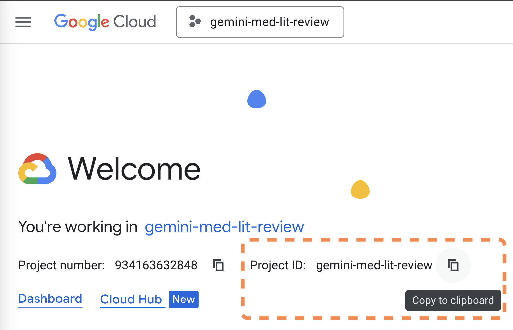
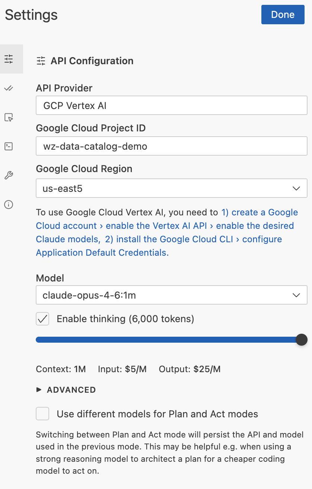
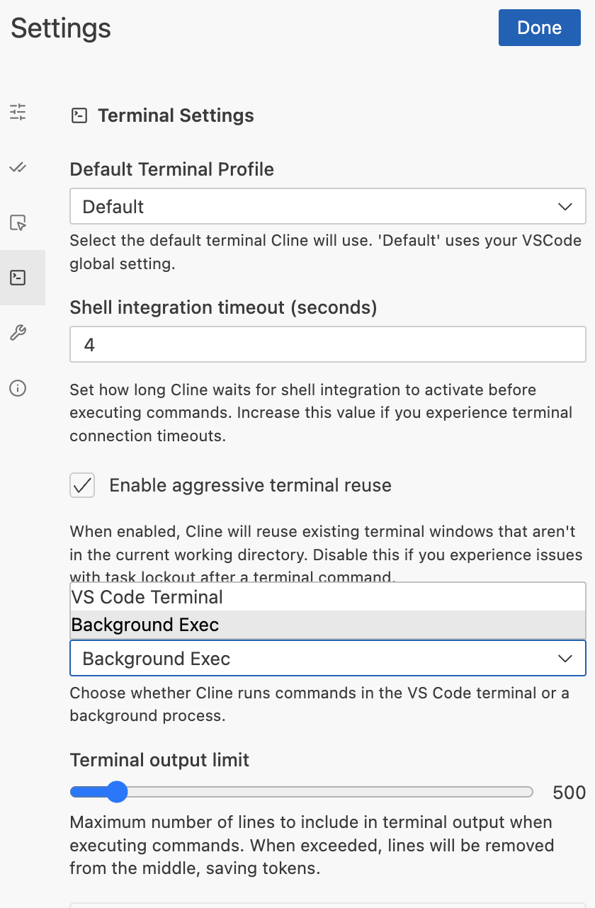

<!--
Copyright 2026 Google LLC

Licensed under the Apache License, Version 2.0 (the "License");
you may not use this file except in compliance with the License.
You may obtain a copy of the License at

    https://www.apache.org/licenses/LICENSE-2.0

Unless required by applicable law or agreed to in writing, software
distributed under the License is distributed on an "AS IS" BASIS,
WITHOUT WARRANTIES OR CONDITIONS OF ANY KIND, either express or implied.
See the License for the specific language governing permissions and
limitations under the License.
-->

# 01 — Agentic Coder Setup

By the end of this guide, you will have an agentic coding assistant on your laptop with ready access to Google Cloud documentation, Cloud Logging, GitHub, and Hugging Face — useful both for the afternoon hackathon and for any healthcare AI work you continue after the datathon. Connections via [Developer API MCP](https://developers.google.com/knowledge/mcp), [Google Cloud Logging MCP](https://docs.cloud.google.com/logging/docs/reference/v2_mcp/mcp), GitHub MCP, and Hugging Face MCP.

### 1. Choose IDE

- **[Visual Studio Code](https://code.visualstudio.com/)** (local machine)
- **[Google Cloud Workstation](https://cloud.google.com/workstations/docs/create-workstation)** (browser-based, includes Code OSS)

### 2. Install gcloud CLI

```bash
# Follow https://cloud.google.com/sdk/docs/install
# Then authenticate:
gcloud auth login
gcloud auth application-default login
```

### 3. Use your datathon Google Cloud Project

For the day of the event, the `Project ID` you'll use is the one issued by Qwiklabs. For continued use after the datathon, create your own project at [console.cloud.google.com/projectcreate](https://console.cloud.google.com/projectcreate) (manage billing at [console.cloud.google.com/billing](https://console.cloud.google.com/billing)).



To use Claude APIs, navigate to Model Garden and enable Vertex AI APIs if it pops up. Enable **both** of the following — Cline uses 4.6 (4.7 isn't supported in Cline yet) and Claude Code uses 4.7:

- [Claude Opus 4.6](https://console.cloud.google.com/vertex-ai/publishers/anthropic/model-garden/claude-opus-4-6) — needed for **Cline** (§4)
- [Claude Opus 4.7](https://console.cloud.google.com/vertex-ai/publishers/anthropic/model-garden/claude-opus-4-7) — needed for **Claude Code** (§7)

### 4. Install Cline

Inside VS Code / Code OSS:

1. Open Extensions (`Ctrl+Shift+X` / `Cmd+Shift+X`)
2. Search for **`Cline`** (publisher: `saoudrizwan`)
3. Install it
4. Click "I have my own API key"
5. Inside the gear settings, Set up your Cline like this with your own `Project ID`:



6. In Terminal settings, Background Exec is typically a good choice:



### 5. Generate a HuggingFace Token (optional)

The HuggingFace MCP gives your AI assistant access to models, datasets, papers, and Spaces.

1. Go to [huggingface.co/settings/tokens](https://huggingface.co/settings/tokens)
2. Click **Create new token**
3. Give it a name (e.g. `cline-mcp`) and select **Read** access
4. Copy the token — you'll paste it in the next step

### 6. Ask Cline to set up its own MCP servers

Have this repo open in your IDE. Start a new task in Cline and paste:

> Set up MCP servers using the template in `01-setup/cline/cline_mcp_settings.template.json`. Install each server per its `_install` instructions, copy the proxy scripts from `mcp-servers/`, and generate the final `cline_mcp_settings.json`. My HuggingFace token is `<HF_TOKEN>`.

Cline will read the config files in [`cline/`](./cline/) and wire everything up.

### 7. Ask Cline to install Claude Code

Open a new Cline task and paste:

> Install Claude Code CLI and set it up using the config in `01-setup/cli-agent/`. Set up the Vertex AI backend, MCP servers, system prompt, and launcher script.

Cline will read the config files in [`cli-agent/`](./cli-agent/) and handle the installation.

---

## What's in this folder

```
01-setup/
├── README.md                              # This file
├── cline/                                 # Cline (IDE) config
│   ├── cline_mcp_settings.template.json   # MCP settings template (all 5 servers)
│   └── mcp-servers/
│       ├── google-cloud-logging/proxy.mjs # stdio proxy for Cloud Logging API
│       └── google-dev-knowledge/proxy.mjs # stdio proxy for Google Dev docs
└── cli-agent/                             # Claude Code config
    ├── README.md                          # Detailed setup
    └── claude-code/
        ├── bin/claude-start               # Launcher (Vertex AI, max context)
        ├── CLAUDE.md                      # Global system prompt
        ├── settings.json                  # Permissions config
        └── mcp/
            └── google-cloud-logging/proxy.mjs  # stdio proxy for Cloud Logging
```
